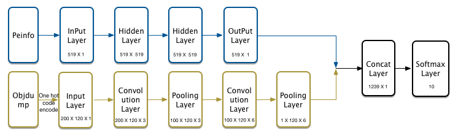

# Machine Learning Part for Holmes Relationship

## OverView
In Spark, we preprocess the data analyzed by Holmes-Totem to get the format data. The format data are used to train a model for classifying the malware in the TensorflowOnSpark.

### Purpose
We use direct relationship score algorithm to get the final relationship score. The prerequisite for this algorithm is the need to know the label of malware. 

## Pre-Processing Data
#### Virustotal Results
Virustotal gives the malware detection signatures of different vendors. Although different vendors have different naming conventions, the keywords in signatures are the same. We drop the prefixes, suffixes and any extra words except for the keywords. And then, we count the number of occurrences of the keyword and keep only those with the number >= 50.  
To a certain malware, we make a loop for the keywords, if this malware has this keyword in its signatures, we assign value 1 to the position of the keyword. Finally, we get a 0-1 list.

#### KMeans clustering in Virustotal
We use the KMeans algorithm to train the results in the last step, and the 3024 samples are divided into ten categories.

*Tips: The reason that I only cluster 3024 malware is that 1). even a small percent is still a lot of malware. 2). VT results for many samples are too generic to give any useful information.*

#### Peinfo 
We extract int values and boolean values from the peinfo analysis results.  
The int values are entropy, virtual address, virtual size, and size separate in the section .text, .data, .rsrc, and .rdata. In addition, the timestamp, the total size of int values is 17.  
We get a dll\_function list by counting the number of dll\_function and keep the only number >= 10000. The size of the list is 502. To a certain malware, we assign true or false when it contains the dll\_function or not.

#### Objdump
By objdump service, we can get the opcodes of the malware. The file: x86Opcodes contains the normal opcodes. We extract the top 10000 opcodes and convert them into int according to opcodes' sequence in the file. 

## Neural Network
  
The figure above shows the framework of the neural network. The peinfo data are trained by multi-layer perceptron, while the objdump are trained by convolution neural network. Finally, we concatenate the two one-dimensional vectors and use softmax layer to get the prediction label.
